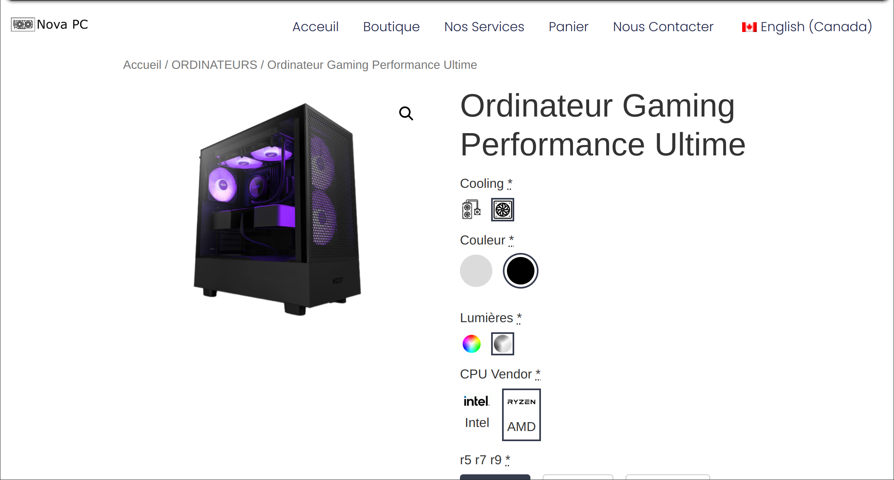
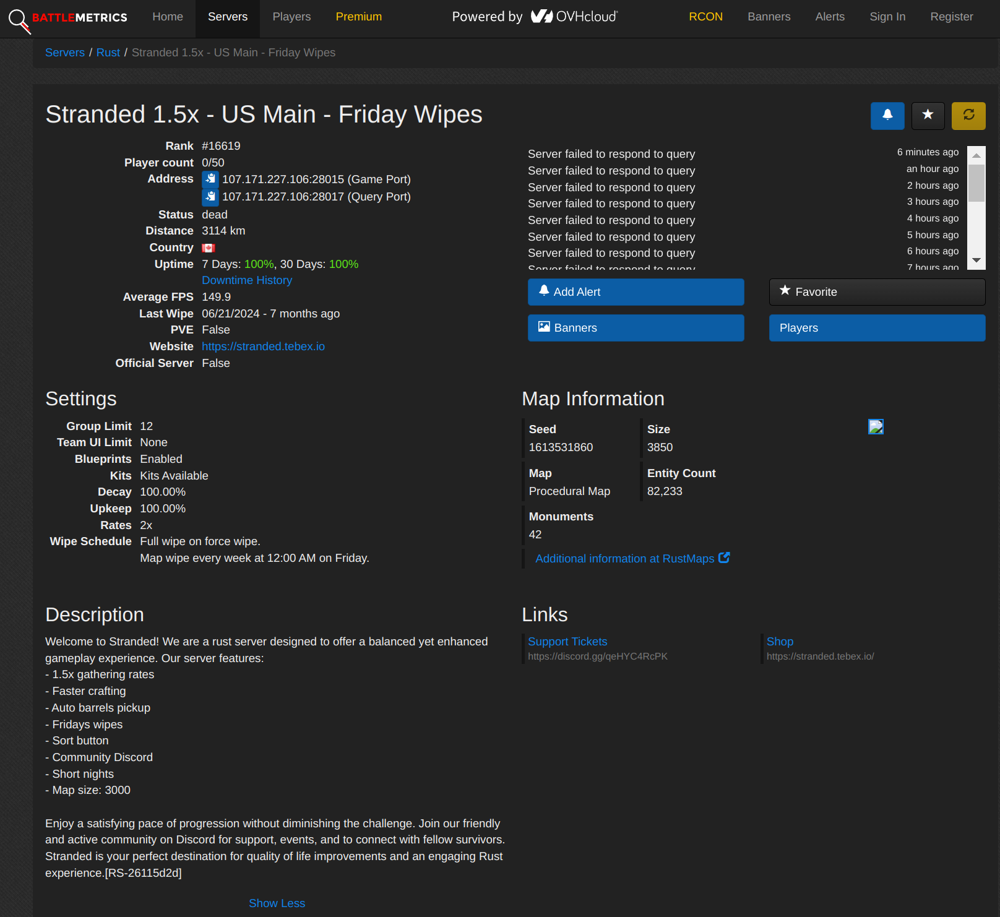

# Nova PC

## Historique

Nova PC a débuté comme une petite entreprise de 3 personnes se concentrant principalement sur les services d'assemblage de PC personnalisés. Nous avons donné un nom officiel à notre activité de support technique qui existait déjà « à côté ». Notre entreprise de PC personnalisés était principalement constituée d'un site web où les clients pouvaient nous écrire un email pour obtenir une explication détaillée de leur configuration, ou utiliser le Configurateur d'Ordinateur Personnalisé intégré basé sur WordPress que nous avions entièrement configuré. Nous avions également un profil Facebook où les clients pouvaient nous contacter directement pour faire réparer leurs problèmes techniques en quelques heures. Nous offrions un service de support technique à domicile qui, à l'époque, était largement moins cher que la concurrence.

Après cette première *phase* de Nova PC sont venus nos projets d'hébergement de serveurs de jeux.

## PlayStranded.net

Nous possédions un Dell PowerEdge R620 que nous utilisions à l'époque comme laboratoire personnel à domicile. L'idée nous est alors venue de réutiliser cette même infrastructure pour en tirer profit. Ce serveur avait suffisamment de ressources pour faire fonctionner 3-4 serveurs du jeu Rust à pleine capacité. Nous avons nommé cette branche de Nova PC "PlayStranded.net". Ces serveurs comportaient des plugins et des mods créés pour améliorer la qualité de vie globale des joueurs. Il nous a fallu environ une semaine pour tout configurer.

## Hébergement de Jeux

Le moment est ensuite venu de changer à nouveau le secteur d'activité de Nova PC. Nous sommes passés du Dell PowerEdge R620 à un Cisco UCS M4 plus récent et plus performant. Notre plan était d'utiliser ce nouveau serveur pour offrir un service d'hébergement de serveurs de jeux pour des titres comme Minecraft et similaires.

## Fermeture de Nova PC

Pour l'instant, Nova PC est fermé indéfiniment. Nous poursuivons actuellement nos études respectives, et notre attention se porte donc principalement sur cela.